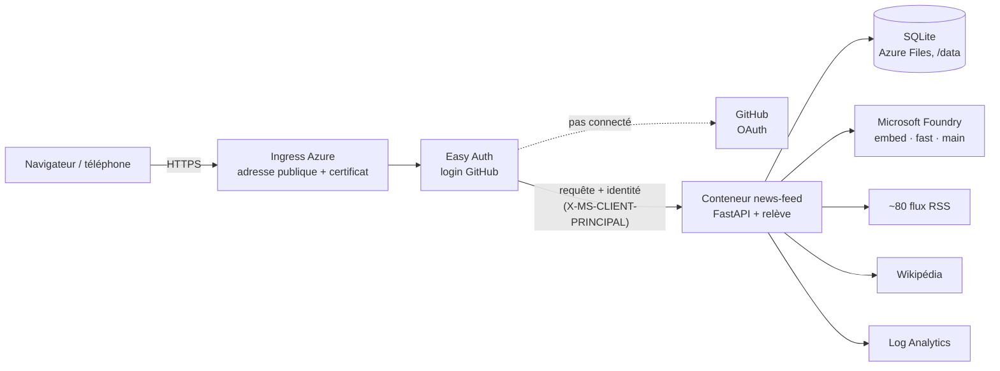
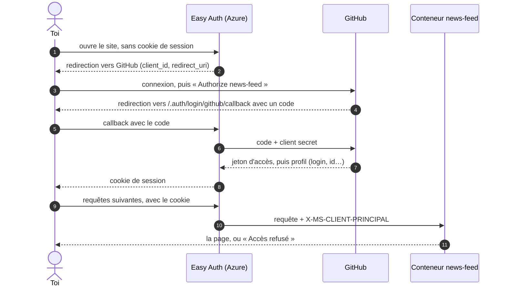
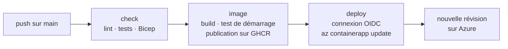

# Comment fonctionne news-feed

Cette page explique l'app de bout en bout :
- ce qui tourne, et où ;
- comment les articles deviennent des stories ;
- comment se fait le login ;
- à quoi sert chaque secret ;
- comment une modification du code arrive en production.

Pour la mise en place, voir le [guide de déploiement](deploiement.md).

## Vue d'ensemble

Un seul conteneur fait tout. Il sert le site, et toutes les 20 minutes il relève les flux en tâche de fond. La base SQLite vit sur un partage de fichiers Azure, hors du conteneur : elle survit aux redémarrages et aux redéploiements.

## Où vit chaque morceau

| Morceau | Où | Rôle |
|---|---|---|
| Code | GitHub, repo `news-feed` | La source de vérité |
| Image Docker | GHCR, `ghcr.io/<compte>/news-feed`, paquet privé | Le code empaqueté avec Python et ses dépendances. Il tourne à l'identique sur un PC, sur Azure ou sur un NAS |
| App en marche | Container App `news-feed`, dans l'environnement `news-feed-env` | Un conteneur unique, toujours allumé (0,25 vCPU, 0,5 Go) |
| Données | Compte de stockage `newsfeed…`, partage `data`, monté sur `/data` | La base `news-feed.db` |
| IA | Ressource Microsoft Foundry, déploiements `embed`, `fast` et `main` | Les modèles d'embeddings et les GPT, appelés par API |
| Logs | Log Analytics `news-feed-logs` | Ce que l'app écrit, gardé 30 jours |
| Login | OAuth App GitHub `news-feed` | Permet à Azure de demander à GitHub qui se connecte |

## Des flux RSS aux stories

Chaque relève enchaîne cinq étapes. Une étape interrompue reprend simplement à la relève suivante, car chacune cherche en base ce qui lui reste à faire.

1. **Téléchargement des flux.** Les flux sont téléchargés en parallèle. Une requête conditionnelle (ETag / Last-Modified) évite de retélécharger un flux inchangé. Les paramètres de suivi sont retirés des URL, ce qui sert aussi à dédoublonner. Les articles de plus de 7 jours sont ignorés.
2. **Regroupement.** Chaque nouvel article reçoit un embedding : un vecteur qui représente son sens, quelle que soit sa langue (`embed`). Il rejoint la story active la plus proche si la similarité dépasse un seuil, sinon il en ouvre une nouvelle.
   - Les seuils ont été calibrés sur une vraie journée de titres FR + EN.
   - Il est plus strict pour les sources spécialisées : en cyber et en IA, tous les titres se ressemblent.
3. **Tags.** Un petit modèle (`fast`) attribue à chaque article de 1 à 3 thèmes, plus `france` s'il concerne d'abord la France. Une story garde les tags portés par au moins un tiers de ses articles.
4. **Traductions.** Pour une story importante sans aucun article dans l'une des deux langues, `fast` traduit le titre et le chapô.
5. **Rétention.**
   - Les stories importantes sont gardées sans limite : elles alimentent les tops sur un mois ou un an, et la recherche.
   - Les stories mineures sont supprimées après 30 jours.

Une story est **importante** si au moins deux médias la couvrent, si l'un d'eux l'a mise à la une, ou si elle vient d'une source spécialisée. Son **score** sur une période est le nombre de médias distincts, plus le nombre de ceux qui l'ont mise à la une.

## L'IA : ce qui est automatique, et ce qui ne l'est pas

| Modèle | Quand | Pour quoi |
|---|---|---|
| `embed` | À chaque relève | Regrouper les articles |
| `fast` | À chaque relève | Tags, titres traduits |
| `main` | Sur un clic, plus la mise à jour des synthèses demandées et le digest du matin | Synthèse détaillée, « Comprendre le contexte », questions de suivi, résumé ou traduction d'un article, brief |

Les réponses de `main` sont gardées : redemander la même chose ne coûte rien.

**La synthèse détaillée** d'une story est rangée à part du fil de questions, avec le nombre d'articles qu'elle couvre.
- Après chaque relève, elle est refaite automatiquement si la story a grossi d'au moins un quart, et d'au moins 2 articles. Une grosse affaire est donc mise à jour quelques fois par jour, pas à chaque relève.
- Entre-temps, la page indique combien d'articles sont arrivés depuis, et propose de la mettre à jour tout de suite.

Seules les stories dont tu as demandé la synthèse sont concernées. Elles ne sont jamais purgées.

**Le digest du matin.** Chaque jour à 7 h (heure de Paris), la relève qui suit rédige, en français et en anglais, un brief des 20 sujets les plus importants des dernières 24 h. C'est le même mécanisme que le bouton *Brief*.
- On le lit sur la page *Digest*.
- L'accueil l'annonce jusqu'à ce qu'il ait été lu.
- Sur un téléphone, le raccourci *Digest du matin* s'obtient par un appui long sur l'icône de l'app. Pour répondre, `main` dispose de plusieurs sources :
- le texte des articles gratuits de la story ;
- deux outils qu'il appelle lui-même : une recherche Wikipédia, pour les bases, et une recherche dans l'archive de l'app, pour l'historique d'un sujet.

Chaque source reçoit un numéro, et l'app transforme chaque citation [n] en lien.

## Le login

### Pourquoi un login, et pourquoi GitHub

L'app est sur Internet. Sans protection, n'importe qui pourrait l'utiliser, et surtout cliquer sur les boutons IA, que l'abonnement Azure paierait.

Plutôt que de coder un système de comptes (mots de passe, sessions, sécurité), on délègue tout à **Easy Auth**. C'est une couche d'Azure placée devant le conteneur, qui sait dialoguer avec des fournisseurs d'identité. L'app ne voit jamais de mot de passe.

On a choisi **GitHub** comme fournisseur pour trois raisons :
- le compte existe déjà ;
- la configuration est simple ;
- il n'y a pas besoin de créer d'application dans l'annuaire Microsoft d'une entreprise, ce qui est souvent réservé aux admins.

### Le déroulé (OAuth)

- **Étapes 2 à 4.** GitHub n'envoie le code qu'à une adresse de retour (*callback*) déclarée dans l'OAuth App. Ainsi, un site pirate ne peut pas l'intercepter.
- **Étapes 6 et 7.** C'est le serveur d'Easy Auth qui échange le code contre un jeton, en présentant le *client secret*. Ce secret prouve à GitHub que la demande vient bien de notre app.
- **Étape 10.** Easy Auth transmet ton identité au conteneur dans l'en-tête `X-MS-CLIENT-PRINCIPAL` : du JSON encodé en base64 qui contient tes *claims* GitHub (login, id, URL du profil…).

### Authentification et autorisation

- **L'authentification** répond à « qui es-tu ? ». GitHub et Easy Auth s'en chargent, et n'importe quel compte GitHub la réussit.
- **L'autorisation** répond à « as-tu le droit ? ». C'est notre code qui s'en charge : le middleware `guard` lit le claim `urn:github:login` et le compare à `NEWS_FEED_ALLOWED_USER`. Tout autre compte reçoit « Accès refusé ».

Personne ne peut fabriquer lui-même cet en-tête. Le conteneur n'est joignable qu'à travers Easy Auth, qui produit l'en-tête lui-même.

> Sur Container Apps, avec le fournisseur GitHub, l'en-tête `X-MS-CLIENT-PRINCIPAL-NAME` arrive **vide** : le login se trouve dans les claims de `X-MS-CLIENT-PRINCIPAL`. On l'a constaté lors du premier déploiement.

Quelques chemins échappent au login :
- **la sonde de santé `/healthz`** : Azure l'appelle directement sur le conteneur pour savoir s'il est vivant ;
- **le manifest et les icônes de la PWA** : le téléphone les télécharge *sans* cookie pour installer l'app, Easy Auth les exclut donc du login (liste `excludedPaths` du Bicep). Ils ne contiennent aucune donnée.

La session Easy Auth dure 30 jours au lieu de 8 heures, pour que l'app installée ne redemande pas le login chaque jour.

## Les secrets

| Secret | Qui s'en sert | Pour quoi | Où il est rangé |
|---|---|---|---|
| Clé Foundry | L'app | S'identifier auprès de Foundry : celui qui a la clé consomme, et l'abonnement paie | `.env` en local. Sur Azure, le secret `foundry-key`, exposé à l'app sous `OPENAI_API_KEY` |
| Token GHCR (classic, `read:packages`) | Azure | Télécharger l'image, qui est privée | Secret `registry-token` |
| Client ID OAuth | Easy Auth | Dire à GitHub quelle app demande le login. Il apparaît dans les URL, il n'est pas secret | Configuration d'Easy Auth |
| Client secret OAuth | Easy Auth | Prouver à GitHub que c'est bien notre app, et pas quelqu'un qui aurait copié le Client ID | Secret `github-client-secret` |

Le Bicep reçoit ces valeurs en paramètres `@secure()`. Elles ne sont pas gardées en clair dans l'historique de déploiement, et Azure ne les réaffiche jamais.

Le déploiement continu, lui, n'utilise aucun secret (voir plus bas).

## Du commit à la production

Trois mécanismes se partagent le travail.

**1. Bicep, pour l'infrastructure.** [infra/main.bicep](../infra/main.bicep) décrit les ressources dans l'état voulu. `az deployment group create` crée ce qui manque et met à jour ce qui diffère. On peut le relancer sans risque : on ne le fait que si l'infra ou un secret change.

**2. GitHub Actions, pour le code**, à chaque push :

- **Toutes les branches et les PR** passent par `check` et `image`.
- **`main` seulement** :
  - publie l'image, avec l'étiquette du commit et `latest` ;
  - la déploie, si les variables `AZURE_*` du repo existent.
- **En local**, le hook *pre-push* lance les mêmes vérifications que `check` : un push qui casserait la CI est arrêté avant de partir.

**3. Les révisions, côté Azure.** Chaque nouvelle image crée une révision :
- Azure démarre le nouveau conteneur, lui envoie le trafic, puis arrête l'ancien.
- L'app attend 60 s avant sa première relève. Ainsi, deux conteneurs n'écrivent jamais en même temps dans la même base SQLite.

### OIDC : déployer sans mot de passe

Pour mettre à jour la Container App, GitHub Actions doit s'authentifier auprès d'Azure. Plutôt que de stocker un mot de passe Azure dans GitHub, on utilise une **fédération d'identité (OIDC)** :
1. On déclare à Azure une règle : « fais confiance aux jetons que GitHub signe pour ce repo-là (désigné par ses identifiants immuables), branche `main` ». C'est l'identité `news-feed-ci`, avec un *federated credential*.
2. À chaque exécution, GitHub fournit au job un jeton signé, valable quelques minutes.
3. Azure vérifie la signature et le repo, puis accorde les droits de l'identité (*Contributor* sur le groupe de ressources).

Rien de secret n'est stocké dans GitHub. Les variables `AZURE_CLIENT_ID`, `AZURE_TENANT_ID` et `AZURE_SUBSCRIPTION_ID` ne sont que des identifiants : sans le jeton signé par GitHub pour ce repo, elles ne servent à rien.

## Les coûts

| Poste | Ordre de grandeur |
|---|---|
| Container App, toujours allumée | 5 à 15 € par mois |
| Stockage et logs | quelques centimes |
| Foundry, à l'usage | Les relèves coûtent peu : embeddings et petit modèle. L'essentiel vient des clics sur les boutons IA et des synthèses tenues à jour, servis par `main`. Le digest ajoute deux appels par jour. |
